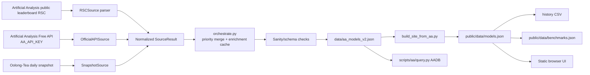

# Model Compass — Repository Review Dossier

> Historical snapshot. This report records repository state and
> verification from 2026-08-22/23. It is not an active source of
> truth; see `docs/STATUS.md` and `docs/ARCHITECTURE.md` for current
> guidance.


**Audit type:** read-only repository, runtime, data, CI, and security audit
**Audit date:** 2026-08-22 UTC
**Repository:** `OptiLabResearch/model-compass`
**Evidence convention:** repository paths and line ranges refer to the audited checkout at commit `6dd03afb1f17e727abf5a0fcc4a1857e9e31372b`, unless stated otherwise.

## 1. Executive summary

Model Compass is a dependency-free static web site for comparing AI language models by Artificial Analysis benchmark scores, composite indices, pricing, throughput, latency, licensing, and model metadata. Its public product is the static site under `public/`; its newer private capability is a normalized 614-model dataset and Python query layer intended to support model-selection and Hermes/agent orchestration decisions.

The repository has two related surfaces:

1. **Public static site:** HTML/CSS/JavaScript plus generated JSON, deployed from `public/` to Cloudflare Pages. The browser loads `public/data/models.json`; there is also a flat `benchmarks.json` export.
2. **Private rich data pipeline:** `scripts/aa/` fetches and normalizes Artificial Analysis data from a public Next.js RSC leaderboard payload, the official Free API, and an Oolong-Tea third-party snapshot. It emits `data/aa_models_v2.json` and `data/aa_pipeline_report.json`; `scripts/build_site_from_aa.py` derives the public JSON.

**Current maturity:** the public site is a functioning, tested static product with defensive validation and a fairly complete UI. The rich pipeline is newly introduced and operationally exercised through the most recent refresh, but it is lightly tested compared with its complexity: the automated pipeline suite is six focused tests, not an end-to-end refresh test. The project is not a benchmark runner; it consumes benchmark results and ranks/filters models. No evidence of live user authentication, server-side application logic, queues, databases, or an in-repository runtime service was found.

**What demonstrably works:** the safe local validation commands pass; Python compilation passes; browser security helper tests pass; the pipeline unit tests pass; the checked-in public data validates as 201 models; the current rich dataset contains 614 models; the Artificial Analysis page was reachable during the audit. Git is clean and `main` matches `origin/main`.

**What is incomplete or constrained:** the live public site returned HTTP 403 from this audit environment, so deployment reachability could not be confirmed. The repository's README still describes the old Free-API/page-scrape refresh path, while the workflow and `AGENTS.md` use the newer RSC/API/snapshot pipeline. The rich dataset has no `math_index` coverage, uneven benchmark/performance/pricing coverage, and depends on parsing an undocumented Next.js RSC payload. There is no meaningful automated test of the full live fetch/merge/build/export workflow, no benchmark execution history or model-comparison experiment runner, and no repository-local service health endpoint.

**Likely intended end state:** a trustworthy, refreshable model intelligence dataset feeding both an interactive public comparison site and programmatic model-selection/orchestration tools, with provenance and fail-closed refresh behavior. The repository is closer to that end state for static comparison than for a production-grade data product or autonomous model-routing service.

### Intended vs implemented vs tested vs currently observed

| Capability | Intended/documented | Implemented | Tested | Observed in audit |
|---|---:|---:|---:|---:|
| Static comparison site | Yes | Yes | Yes | Local validators pass |
| Rich AA ingestion | Yes | Yes | Focused unit tests only | Last committed refresh says all 3 sources healthy |
| Public site derived from rich data | Yes in workflow/AGENTS | Yes | Validator checks output | Checked-in output has 201 models |
| Programmatic query layer | Yes (`scripts/aa/README.md`) | Yes | Not covered by `test_pipeline.py` | Module loads; no benchmark of query correctness |
| Benchmark execution/evaluation | Not actually the repo's role | No runner found | No | No recent benchmark run to report |
| Cloudflare production deployment | Documented | Configuration only in repo | Not deploy-tested | Live URL returned 403 from audit host |
| Weekly autonomous refresh | GitHub Actions workflow | Configured | Not locally end-to-end tested | Last checked-in generated data: 2026-08-21 |

## 2. Repository identity and environment

- Repository: `OptiLabResearch/model-compass`
- Repository name: `model-compass`; GitHub remote `https://github.com/OptiLabResearch/model-compass.git`
- Branch: `main`; `HEAD` and `origin/main`: `6dd03afb1f17e727abf5a0fcc4a1857e9e31372b`
- Latest commit: `docs: align AGENTS.md with the rich RSC data pipeline`, 2026-08-21 20:58:55 UTC
- Working tree: clean; no ordinary untracked files. Ignored operational files include `.wrangler/`, `data/aa_cache/`, and Python bytecode caches.
- Repository disk size: 58 MB (`du -sh .`), including Git objects and generated/raw local artifacts.
- No repository package manifest, requirements file, lockfile, database migration, or container definition was found. The site has no package installation step; scripts use Python standard library and Node's built-ins.
- `.env` is intentionally ignored; credentials must remain in the repository-root file with mode `0600` and must never be exposed.
- `.env.example` exists; GitHub Actions supplies `AA_API_KEY` as a repository secret in `.github/workflows/refresh.yml:38-41`.
- External/runtime locations are described only by repository configuration in this historical snapshot.
- No repository-owned database, queue, or long-running application service was found.
- The documented refresh is GitHub Actions; no repository-local scheduler was identified.

## 3. Repository map

```text
model-compass/
├── public/                         Complete deployable static site; publish only this directory
│   ├── index.html                  Main comparison page
│   ├── models.html                 Secondary/static page
│   ├── assets/                     Browser JS/CSS/fonts
│   │   ├── models.js               Table/filter/sort/compare/preset logic (~669 lines)
│   │   ├── nav.js                  Navigation, escaping, outbound URL allowlist
│   │   ├── theme-init.js           Theme bootstrap
│   │   └── *.css, fonts/*.woff2    Presentation assets
│   ├── data/models.json            Browser data source, 201 records in audit checkout
│   ├── data/benchmarks.json        Flat benchmark export, 201 records
│   ├── _headers                    CSP and security/deployment headers
│   ├── 404.html, favicon.svg, og.png
│   └── [no server code]
├── scripts/
│   ├── aa/                         New normalized private AA pipeline
│   │   ├── orchestrate.py          Fetch, merge, validate, atomic output
│   │   ├── rsc_source.py            Primary RSC parser/normalizer (~530 lines)
│   │   ├── official_api_source.py   Official API adapter (~249 lines)
│   │   ├── snapshot_source.py       Third-party snapshot adapter (~371 lines)
│   │   ├── http.py                   Retry/cache/atomic-write helpers
│   │   ├── schema.py                 Normalized record template and bounds
│   │   ├── validate.py               Sanity and schema-drift checks
│   │   ├── source_base.py             SourceResult/adapter contract
│   │   ├── query.py                  AADB programmatic ranking/query class
│   │   ├── crossvalidate.py           Source comparison utility
│   │   ├── demo_query.py              Query demonstration
│   │   └── tests/test_pipeline.py     Six focused pipeline tests
│   ├── fetch_aa_models.py            Legacy Free API + page scrape (~1,010 lines); retained/reference path
│   ├── build_site_from_aa.py         Rich dataset → public site schema (~388 lines)
│   ├── export_history_csv.py         Dated CSV export
│   ├── export_benchmarks_json.py     Public benchmark export
│   ├── validate_site.py              Public boundary/data/CSP/history validator
│   ├── test_fetch_aa_models.py       Nine unittest cases for legacy helpers
│   └── test_browser_security.mjs     Node VM security helper tests
├── data/
│   ├── aa_models_v2.json             Committed normalized rich dataset, 6.4 MB, 614 models
│   ├── aa_pipeline_report.json       Last source health/coverage report
│   ├── enrichment_cache.json         Legacy cache used as backfill
│   ├── aa_cache/                     Ignored raw source payloads and cached snapshots
│   └── history/*.csv                 Dated public snapshots
├── .github/
│   ├── workflows/ci.yml              PR/push syntax, validation, browser security
│   ├── workflows/refresh.yml         Sunday 19:00 UTC data refresh and commit
│   ├── dependabot.yml, issue templates, PR template
├── AGENTS.md                         Project operating instructions; newer pipeline description
├── README.md                         User setup/docs; partially stale refresh description
├── SECURITY.md                       Vulnerability reporting and security boundaries
├── CONTRIBUTING.md                   Contribution guidance
├── wrangler.toml                     Cloudflare Pages output directory
├── .env.example                      Credential shape only
├── .gitignore                        Secrets/cache/build exclusions
└── LICENSE                           MIT source license
```

Generated/runtime distinctions: `public/data/*.json`, `data/aa_models_v2.json`, `data/aa_pipeline_report.json`, and history CSVs are generated but committed. `data/aa_cache/` is raw/cache state and ignored. `__pycache__/` and `.wrangler/` are ignored local artifacts. The public directory is deliberately an allowlisted deployment boundary (`scripts/validate_site.py:16-26,87-110`).

## 4. Architecture and data flow

The system is a batch-oriented static-data pipeline, not a request-time application.



### Major component behavior

- **RSCSource:** fetches a public Next.js React Server Components/Flight payload, searches for a `"rows":[` array, bracket-matches JSON, validates host/model row shape, and normalizes fields. It tries known `_rsc` tokens and can discover a current token from the page (`scripts/aa/rsc_source.py:40-62,89-180`). It preserves raw payloads in ignored cache files.
- **OfficialAPISource:** uses `AA_API_KEY` for the official API as baseline/ID/validation input. It is optional and the orchestrator can continue when absent, subject to primary-source sanity.
- **SnapshotSource:** obtains a third-party Oolong-Tea snapshot for fallback/cross-check and additional coverage.
- **Merge:** `orchestrate.py:108-154` deduplicates by normalized slug with priority RSC > official API > snapshot, fills missing fields from lower-priority records, unions raw fields, and records source provenance.
- **Legacy enrichment:** `orchestrate.py:157-191` can backfill selected benchmark/index fields from `data/enrichment_cache.json`, even though that cache belongs to the previous pipeline.
- **Validation:** primary RSC records and the final merged set are checked for minimum count, required fields, duplicate slugs, selected non-finite numeric values, and intelligence-index coverage (`validate.py:46-100`). Schema drift is warning-only (`validate.py:103-108`).
- **Atomic outputs:** `aa.http.atomic_write_json` is used by the orchestrator and export/build scripts, reducing partial-file risk.
- **Public derivation:** `build_site_from_aa.py` maps rich records into the exact legacy frontend schema, clamps some fields, and runs output validation. This preserves UI compatibility but means rich fields not mapped into the site are unavailable to public users.
- **Browser:** `public/assets/models.js` renders a pre-generated table and implements search, release-date filter, multi-select creators, numeric filters, sorting, presets, compare mode, CSV/Markdown actions, themes/navigation/hash state, and responsive behavior. There are no API requests at runtime beyond same-origin JSON loading.

### Failure and fallback behavior

- If no source is healthy and an existing dataset has models, the orchestrator keeps the previous dataset and exits 0 (`orchestrate.py:255-266`). This protects publication from empty output but can make a stale success look operationally green.
- The documented `--offline` mode is inconsistent with its stated behavior: `orchestrate.py:242-247` maps `args.offline` to `refresh=True`, which tells adapters to bypass disk caches and attempt network fetches. The previous dataset fallback still prevents empty replacement, but the mode is not strictly cache-only.
- RSC primary sanity failure aborts the run (`orchestrate.py:88-97`).
- A source can be unhealthy while another source supplies data; the report records per-source errors. The scheduled workflow fails visibly and opens/comments on a `data-refresh` issue when a step fails (`refresh.yml:62-94`).
- Raw RSC/snapshot/API cache files are ignored by Git, so they are available locally after a run but are not part of the repository evidence unless separately retained.
- There is no runtime fallback UI or client-side refresh. A bad committed JSON file would affect the static site until the next deployment/commit is corrected.

## 5. User workflows

### Local viewing

1. User clones the repo and runs `python3 -m http.server 8000 --directory public` (`README.md:7-17`).
2. Browser loads `index.html`, same-origin assets, and `data/models.json`.
3. User searches model name/creator/slug, filters by pricing/indices/benchmarks/speed/latency, chooses presets, sorts columns, selects models for comparison, and exports comparison data. Exact UI behavior is implemented in `public/assets/models.js`.
4. Opening HTML via `file://` is intentionally unsupported because the page fetches JSON.

### Data refresh

The GitHub Actions schedule runs Sundays at 19:00 UTC or manually (`.github/workflows/refresh.yml:7-11`):

1. Checkout pinned action SHAs and set up Python 3.12.
2. Run `python3 -m scripts.aa.orchestrate` with `AA_API_KEY`.
3. Run `build_site_from_aa.py`.
4. Export history CSV and public benchmarks JSON.
5. Commit generated artifacts only when changed and push to `main`.
6. On failure, create or comment on a labeled GitHub issue.

The workflow has write permissions for repository contents and issues (`refresh.yml:13-15`); this is intentional automation scope, not a read-only data fetch.

### Programmatic model selection

A Python caller imports `AADB` and loads `data/aa_models_v2.json` (`scripts/aa/query.py:27-34`). Available query families include top composite index, benchmark leader, intelligence/coding per dollar, intelligence per evaluation task, quality vs speed, fastest, cheapest, and backup candidates (`query.py:40-188`). Queries return records, not a server API or persisted decision log.

### Cross-validation/demo

`python3 scripts/aa/crossvalidate.py --api` compares source datasets where available; `demo_query.py` exercises query examples. These are utilities, not scheduled production jobs.

## 6. Hermes / agent / orchestration integration

No Hermes runtime configuration, Discord channel configuration, MCP declaration, plugin, agent prompt, or autonomous model-routing service was found inside this repository. The project is connected operationally to the surrounding Hermes workspace only through the project directory/channel conventions and the existence of `AADB` as an importable query layer.

Configured in-repository orchestration is limited to:

- GitHub Actions refresh scheduling and failure issue automation (`.github/workflows/refresh.yml`).
- Python source adapters and query helpers.
- No primary/fallback LLM provider is configured in repo files.
- No model calls, prompt templates, agent handoff, retry budget, concurrency pool, queue, or Hermes skill/MCP configuration is present.

Therefore, any claim that this repository autonomously selects or routes models would be **intended integration**, not an implemented end-to-end behavior. The dataset can support such an integration, but no caller was found in the checkout.

## 7. Feature inventory

| Feature | Main paths | Status | Evidence / limitation |
|---|---|---|---|
| Static model comparison table | `public/index.html`, `public/assets/models.js` | Working and tested | Public validator passes; browser helper tests pass; no full browser E2E suite |
| Search and release-date filtering | `models.js` | Working but lightly tested | Code exists; not covered by automated DOM interaction tests |
| Numeric filters | `index.html`, `models.js` | Working but lightly tested | Code supports many metrics; no behavior-level test matrix |
| Creator multi-select | `index.html`, `models.js` | Working but lightly tested | Implemented; no browser E2E assertion |
| Presets | `models.js` | Working but lightly tested | Eight hard-coded threshold presets; thresholds are data-version-sensitive |
| Sorting | `models.js` | Working but lightly tested | UI validator checks initial Intelligence sort; other sorts untested |
| Compare mode | `models.js` | Working but lightly tested | Selection/export logic present; no E2E test |
| CSV/Markdown export | `models.js`, `export_*` scripts | Working but lightly tested | Security-focused helper tests only; export output not broadly tested |
| Theme/navigation/hash state | `theme-init.js`, `nav.js`, `models.js` | Working but lightly tested | Syntax/security checks; no visual/responsive E2E |
| Public data validation | `validate_site.py` | Working and tested | Passed with 201 models; strong allowlists/CSP/reference checks |
| Legacy fetch pipeline | `fetch_aa_models.py` | Working but legacy/dead for scheduled site refresh | Retained and unit-tested; README still presents it as refresh path; workflow does not call it |
| RSC leaderboard ingestion | `aa/rsc_source.py` | Working but lightly tested | Last report healthy; parser relies on undocumented payload shape |
| Official Free API adapter | `aa/official_api_source.py` | Working but lightly tested | Last report healthy; requires secret; not live-tested in this audit |
| Oolong snapshot adapter | `aa/snapshot_source.py` | Working but lightly tested | Last report healthy; third-party dependency |
| Source merge/provenance | `aa/orchestrate.py` | Working and focused-tested | Merge priority tested; full source combination not tested end-to-end |
| Fail-visible sanity checks | `aa/validate.py` | Working and focused-tested | Six pipeline tests pass; some checks are warnings or narrow numeric paths |
| Rich dataset output | `data/aa_models_v2.json` | Working but lightly tested | 614 committed records and report; no schema JSON Schema or full contract test |
| Programmatic query layer | `aa/query.py` | Partially implemented | Many ranking helpers exist, but no tests were found for ranking semantics, ties, missingness, or output contracts |
| Cross-validation | `aa/crossvalidate.py` | Experimental/lightly tested | Utility exists; no recorded result artifact found |
| Weekly refresh | `.github/workflows/refresh.yml` | Configured, not independently verified here | Last generated data is present; no local replay of live workflow |
| Cloudflare Pages deployment | `wrangler.toml` | Configured, deployment not verified | Live URL returned 403 from audit environment |
| Benchmark runner | — | Not implemented | Repo consumes AA benchmark data; no task runner, repetitions, statistical analysis, or cost experiment code found |

## 8. Data sources and external dependencies

| Source | Access | Authentication | Role/status | Caching/fallback |
|---|---|---|---|---|
| Artificial Analysis leaderboard RSC | HTTPS Next.js RSC/Flight payload | None | Primary rich source; last report healthy, 411 records | Raw bytes in ignored `data/aa_cache/`; token discovery and parser fallback |
| Artificial Analysis Free API | HTTPS API adapter | `AA_API_KEY` | Baseline/IDs/validation; last report healthy, 610 source records | HTTP helper/cache; optional in orchestrator |
| Oolong-Tea snapshot | HTTPS third-party daily snapshot | None documented in repo | Fallback/cross-check; last report healthy, 570 records | Snapshot adapter/cache |
| Cloudflare Pages | Deployment of `public/` | External account/CI configuration | Intended production host | No deployment API or health check in repo |
| GitHub Actions/GitHub Issues | Workflow service | GitHub Actions token and repository secret | Refresh scheduler, generated commits, failure issue | Concurrency group; issue de-duplication by label |
| Python 3.12 | Local/CI runtime | None | Required by README/workflows | No lockfile; standard-library implementation |
| Node.js | CI security/syntax checks | None | Required for `.mjs` and `node --check` | No package dependencies |

### Artificial Analysis details

The repository documents the RSC source as a public leaderboard response containing a host-model `rows[]` table with richer benchmark, pricing, performance, and metadata fields (`scripts/aa/rsc_source.py:1-23`). The parser converts source fractions to 0–100 percentages and treats zero performance values as unmeasured (`rsc_source.py:64-83`). It currently captures composite indices, many benchmarks, context, creator, modalities, parameters where exposed, licensing, pricing, percentiles/performance, cost-per-task, and provenance. `math_index` is not obtained in the committed dataset: coverage is 0/614. The official Free API and public sources do not provide the full Pro/Commercial field set according to project documentation.

Last committed pipeline report (`data/aa_pipeline_report.json`, generated `2026-08-21T17:11:51Z`):

- RSC healthy: 411 records, fetched `17:11:43Z`
- Official API healthy: 610 records, fetched `17:11:44Z`
- Snapshot healthy: 570 records, fetched `17:11:46Z`
- merged total: 614 models
- intelligence index: 601/614; coding 223/614; agentic 186/614; omniscience 480/614; context 609/614; pricing input coverage is described as 439 in `AGENTS.md`, while the report omits pricing coverage
- benchmark coverage ranges from 28–576 for named metrics; `math_index`, `aime`, `gpqa_diamond`, `mmlu_pro`, `math_500`, and omniscience hallucination rate are 0 in the report under those exact normalized names
- public derived site contains 201 models, not all 614 rich records; the independent audit counted 193 public records with non-hallucination metrics

A notable evidence inconsistency exists: `scripts/aa/README.md` says 609 merged models and its coverage figures differ slightly from the committed report, while the current report and data contain 614. This may reflect a refresh/schema change, but the documentation was not fully synchronized.

## 9. Data model and storage

### Rich record

`aa/schema.py` defines the normalized template. Records are JSON objects keyed operationally by `slug`; they include original IDs/slugs, source, creator, dates, flags, indices, benchmarks, pricing, performance, raw fields, and merge provenance. The top-level rich file has `version`, `generated_at`, `coverage`, and `models`.

### Public record

`build_site_from_aa.py` maps rich records to the legacy schema expected by `models.js`: identity, dates, modalities, composite metrics, benchmarks, pricing, cost-per-task, performance, derived values, feature flags, and source markers. The output has `version`, intelligence-index version/methodology metadata, scrape timestamp, source URL/method, models, and coverage.

### History and provenance

`data/history/*.csv` stores dated snapshots of the public 201-model view. The rich dataset stores source/provenance and preserves selected unknown fields in `raw_fields`; raw HTTP payloads are ignored local cache. No database, relational IDs, foreign keys, migrations, or append-only rich history were found. The weekly workflow commits a new rich dataset in place and a dated public CSV, so the rich JSON itself is overwritten rather than versioned as dated snapshots.

### Current data limitations

- Deduplication is by normalized slug. Host/provider variants are merged into one model record, so provider-level differences may be represented only partially in nested/provenance fields.
- Missing metrics remain missing in most query methods, which is preferable to zero-fill, but public preset thresholds and comparisons can silently select the subset with available metrics.
- `omniscience_index` in the rich data includes a negative minimum (observed `-89`), while the public builder clamps it for site output; the two surfaces therefore do not represent this field identically.
- `math_index` exists in schema/code but has zero current coverage.
- The public site intentionally discards most rich dataset fields and only publishes a 201-model subset.
- No explicit record-level source timestamp, schema version, or freshness policy is surfaced in each public row beyond top-level/generated fields.

## 10. Benchmarking/evaluation logic

This repository does **not** execute model benchmarks. It imports Artificial Analysis benchmark results and exposes ranking/filtering. The relevant implemented logic is:

- `AADB.best_for_benchmark()` sorts available scores descending and excludes absent values (`query.py:92-100`).
- `value_intelligence_per_dollar()` divides intelligence index by a 3:1 blended one-million-token price (`query.py:102-112`).
- `value_intelligence_per_task()` divides intelligence by AA evaluation cost (`query.py:114-124`).
- `quality_vs_speed()` returns highest quality first among models with positive throughput; it does not compute a Pareto frontier or combine speed into the sort score (`query.py:137-146`).
- `backup_candidates()` uses a score gap from the best and does not actually enforce different creator/vendor despite its docstring saying “different creator” (`query.py:168-188`). This is a confirmed semantic mismatch: the code filters by score and optional open weights only; it does not exclude the primary creator.
- `cheapest_1m(blind=True)` filters to open-weight models, although the parameter name does not make that restriction obvious (`query.py:157-166`). The intended meaning should be confirmed before treating this as a stable public API.
- `AADB` rankings use richer private precision while the browser displays rounded values, so close rankings can differ slightly between programmatic and UI views. The query demo was run successfully and loaded 614 models, but no automated query-contract tests were found.
- The public UI has hard-coded presets and thresholds in `models.js:220-230`, but no statistical rationale, confidence intervals, repetition controls, randomization, task prompts, cost accounting, or model-run records.

No recent benchmark run artifacts were found. Consequently, requested raw benchmark-run details (models, tasks, scores, durations, costs, conclusions) cannot be reported as repository facts. The project should not be described as having proven that one model is better than another through its own experiments; it ranks externally supplied AA measurements.

## 11. Testing and validation

Safe commands actually run from the repository:

```text
python3 -m py_compile scripts/*.py scripts/aa/*.py
python3 scripts/test_fetch_aa_models.py
python3 scripts/validate_site.py
node --check public/assets/nav.js
node --check public/assets/models.js
node --check public/assets/theme-init.js
node scripts/test_browser_security.mjs
python3 scripts/aa/tests/test_pipeline.py
```

Results:

- Legacy unittest: **6 tests, all passed** (the file contains nine test methods/helpers in its AST, but the command output reported six executed tests).
- Public validator: **passed**, “Validated secure public output with 201 models”. It checks public tree allowlist, local references, external hosts, CSP/security headers, fonts, data schema, benchmark export consistency, and formula-safe history CSV.
- Browser security helpers: **passed**. Checks HTML escaping, JavaScript/data/protocol-relative URL rejection, and allowed Artificial Analysis URL.
- Node syntax checks: passed.
- Rich pipeline tests: **all passed**: missing RSC rows, malformed rows, duplicate slugs, rich-over-thin merge priority, non-finite detection, and RSC normalize round-trip.
- No coverage report was configured or produced.
- No full browser E2E tests, integration tests against live sources, end-to-end refresh/build/export test, property tests for schema, or query-layer tests were found. The documented `pytest` command path was also checked: `pytest` is not installed, although the repository's standalone test scripts do not require it.
- CI (`.github/workflows/ci.yml`) runs Python compilation, the legacy fetch tests, public validator, Node syntax checks, and browser security test. It does **not** run `scripts/aa/tests/test_pipeline.py`, the rich build, cross-validation, or the full refresh workflow.

Critical paths with limited/no automated coverage: RSC token discovery and live response parsing, official API response pagination/normalization, snapshot schema drift, source merge with real payloads, public derivation from 614 rich records, query ranking correctness, UI interaction behavior, Cloudflare deployment, and scheduled issue notification.

## 12. Current runtime health

- Local repository validation is healthy as described above.
- The last committed pipeline report shows all three data sources healthy on 2026-08-21 17:11 UTC.
- The current rich dataset and public output are internally parseable and pass checks.
- No Model Compass daemon, container, queue, database, or local scheduled refresh was found running on the host.
- `https://artificialanalysis.ai/models` returned HTTP 200 during the audit. `https://models.optiqo.dev/` returned HTTP 403 from this host; this prevents confirming public production availability, but does not distinguish deployment failure from access/WAF policy.
- No repository-specific logs or alert history were found. GitHub remote/history integrity checks passed (`git ls-remote origin main`, `git fsck --full`, and `git diff --check HEAD`); GitHub Actions run history was not independently inspected from the checkout, so the workflow remains the operational source of truth for future runs.
- Local nginx is active and syntactically valid, but port 80 served the default “Welcome to nginx!” page rather than Model Compass. This is consistent with the documented Cloudflare Pages deployment model, but confirms that local nginx is not evidence of a local Model Compass deployment. No `wrangler` executable was found on PATH.
- Disk headroom was 82 GB. No project-specific resource pressure was observed.

Operational conclusion: **data artifacts and local checks healthy; production reachability and autonomous refresh observability not independently verified.**

## 13. Git history and development state

Recent history shows a rapid transition from the legacy Free-API/page-scrape pipeline to the rich adapter pipeline:

```text
6dd03af docs: align AGENTS.md with the rich RSC data pipeline
feeb82c data: weekly refresh 2026-08-21
2c2f081 fix(site): build site models.json from rich RSC dataset
ad07d21 feat(aa): private adapter-based AA data pipeline (RSC+API+snapshot) (#5)
7e628c6 data: weekly refresh 2026-08-16
f8bf85d fix(ui): harden CSV download and bump models.js cache-buster
75df4ac fix(ui): defer blob URL revocation and add row fallback for CSV export
6e83c6e Add CSV export for selected models and blank missing benchmarks
...
```

The history indicates the rich pipeline was added immediately before the latest refresh and documentation alignment. No branches other than `main` and its remote tracking branch, tags, or unfinished local changes were observed. Searches found no meaningful TODO/FIXME/HACK/stub markers in source; matches were UI placeholders and text such as “placeholder”.

## 14. Code quality and maintainability

### Strengths

- Clear source-adapter separation and a shared `SourceResult` contract.
- Standard-library-only implementation reduces install and supply-chain surface.
- Atomic writes, explicit allowlists, strict CSP, formula-safe CSV handling, and URL/HTML escaping are unusually good defensive choices for a static site.
- The public deployment boundary is explicit and validated.
- Data provenance and raw unknown fields are preserved in the rich pipeline.
- CI pins third-party GitHub Actions to full commit SHAs (`ci.yml`, `refresh.yml`).
- The code has useful module docstrings and project instructions in `AGENTS.md`.

### Fragilities

- `scripts/fetch_aa_models.py` remains a 1,010-line legacy implementation alongside the newer pipeline, and `build_site_from_aa.py` deliberately mirrors parts of its schema/featured-slug behavior. This creates duplicated policy and drift risk.
- `rsc_source.py` is a large parser for an undocumented, changing frontend payload; its extraction strategy is defensive but necessarily coupled to AA internals.
- CI does not execute the new pipeline tests or build path, leaving the most important new code outside the required gate.
- No dependency lockfile or reproducible environment specification exists beyond Python/Node version statements.
- Schema is implicit Python dictionaries, not a separately versioned JSON Schema or typed model.
- Validation has narrow numeric-path coverage and treats unknown normalized fields as warnings, not failures.
- `backup_candidates()` behavior does not match its stated cross-vendor semantics.
- `AADB` loads the entire 6.4 MB JSON file into memory, acceptable for this scale but not a service-grade storage interface.
- Static UI logic is concentrated in a ~669-line script with no modular build/test structure; behavior-level regressions could pass syntax and security tests.
- The README and `scripts/aa/README.md` contain stale or conflicting pipeline/model-count descriptions.

## 15. Security and safety

### Confirmed positive controls

- No secret value was printed or found in tracked repository files during this audit. `.env` is ignored; GitHub Actions uses a secret reference.
- Public deployment has a strict CSP: no inline scripts/styles, no third-party script/connect hosts, `frame-ancestors 'none'`, HSTS, and restrictive permissions (`public/_headers:1-23`).
- Public tree, file suffixes, symlinks, local references, external hosts, and size are allowlisted (`validate_site.py:87-132`).
- Browser helper functions reject JavaScript, data, protocol-relative, backslash-ambiguous, and unapproved external URLs (`test_browser_security.mjs:21-29`).
- CSV text fields are checked against spreadsheet formula prefixes (`validate_site.py:241-257`).
- GitHub workflow actions are pinned by SHA and CI uses read-only contents permission. The refresh workflow necessarily has contents/issues write permission to commit generated data and alert failures.

### Confirmed or probable risks

- **Confirmed documentation/configuration drift:** README still tells users to run the retired/legacy refresh path (`README.md:35-47`), while the active workflow uses `scripts.aa.orchestrate`. This can cause operators to refresh the wrong dataset.
- **Probable upstream parser fragility:** RSC parsing depends on an undocumented frontend payload and token/header contract. The code fails visibly on missing rows, but semantic field drift can still pass if row shape remains plausible.
- **Confirmed provenance gap:** RSC records are normalized with source metadata identifying `rsc`, but the per-record `intelligence_index_version` is not populated from that metadata; the dataset-level version is separately hard-coded. This makes record-level provenance weaker than the top-level report.
- **Probable shared-workspace supply-chain risk:** the independent audit found group/setgid-writable directories and several group-writable files (for example, `2775` directories and `0664` files). This may be intentional for the shared project workspace, but it increases risk if all group members are not trusted.
- **Probable stale-success ambiguity:** when all live sources fail but an old dataset exists, the orchestrator returns success after keeping the old output (`orchestrate.py:255-264`). The workflow may not open a failure issue for this path, and the output does not appear to be marked stale at top level.
- **Probable GitHub Actions supply-chain/data-integrity exposure:** refresh has write access and executes network-derived parsing plus commits generated JSON. Pinned action SHAs reduce action drift, but there is no signed-data or independent review gate for generated output.
- **Probable external-content trust issue:** scraped/third-party fields are normalized and published; validation guards shape/ranges only for selected fields. No broad content-length, Unicode, field-cardinality, or semantic anomaly policy was found.
- **Theoretical exposure:** raw cached payloads may contain more upstream metadata than intended and are ignored rather than governed; local permissions were not exhaustively audited because the cache contains no committed secret by design.

No command injection, shell execution, deserialization of pickles, or server-side user-input handling was found in the inspected Python scripts. Network access uses `urllib`; outbound URLs are hard-coded or derived from controlled upstream values. This is a static site, so SSRF is not a client-side server risk in the checked-in application.

## 16. Performance, cost, and resource usage

- The rich dataset is 6.4 MB JSON; the public `models.json` is ~634 KB and `benchmarks.json` ~147 KB. The repository is 58 MB including Git/cache artifacts.
- The RSC source documentation describes a roughly 2.5 MB payload and at most one fetch per run with disk caching. The parser has a 60-second fetch timeout in the shown source path.
- The scheduled workflow has a 10-minute job timeout (`refresh.yml:19-20`).
- HTTP helper code provides retry/backoff/rate-limit/cache/atomic-write facilities. No measured benchmark duration, network volume, CPU/RAM profile, or cost report was committed.
- The official API requires a key but no cost/quota accounting is stored in the pipeline report. The RSC and snapshot sources are unauthenticated; operational rate limiting is described but not independently measured.
- Browser performance is favorable for a static site but the table is rendered client-side from a fairly large JSON file; no load-time or mobile performance measurements were found.
- No database/query bottleneck, queue backlog, or accumulated log issue was found. Rich raw cache can accumulate locally because `data/aa_cache/` is ignored and no retention policy was found.

## 17. Observability and operations

Existing controls:

- Structured-ish INFO logging in pipeline scripts.
- Per-source health, record counts, fetch times, errors, field coverage, benchmark coverage, total models, and parser versions in `data/aa_pipeline_report.json`.
- Fail-closed sanity checks and raw cache preservation.
- GitHub issue creation/commenting on workflow failure.
- GitHub commit history acts as a basic audit trail for generated public data.
- Cloudflare/static headers provide browser security but no application health endpoint.

Gaps:

- No metrics backend, alerting outside GitHub issues, freshness SLA, dashboard, or automatic stale-data banner was found.
- A retained old dataset can lead to a zero-exit stale fallback, so an external observer may need to inspect timestamps/report rather than job status alone.
- There is no restore/rollback runbook in the repository beyond Git history and Cloudflare deployment history.
- Raw caches are local/ignored; they are useful for debugging but not centrally retained for independent reproduction.

## 18. Documentation audit

Important documents: `README.md`, `AGENTS.md`, `scripts/aa/README.md`, `CONTRIBUTING.md`, `SECURITY.md`, workflow YAML, and `wrangler.toml`.

Findings:

- `AGENTS.md` is the most current pipeline description and correctly says the rich pipeline feeds the site.
- `.github/workflows/refresh.yml` is also current in execution order.
- `scripts/aa/README.md` is mostly useful but reports 609 merged models and coverage values inconsistent with the current 614-model report.
- Top-level `README.md:35-47` still describes the legacy Free API + page scrape as the weekly refresh and instructs users to run `fetch_aa_models.py`; this conflicts with the active workflow and `AGENTS.md`.
- README says Python 3.12 or newer, while some commands use `python3`; CI explicitly selects 3.12. There is no lockfile or environment manifest.
- The repository does not document the exact public/private dataset boundary sufficiently prominently for a new reviewer: public has 201 records, rich data 614.
- No runbook documents how to diagnose a stale-success fallback, inspect ignored raw RSC payloads, or verify Cloudflare production reachability.

## 19. Consolidated known limitations and technical debt

| Severity | Limitation | Evidence | Consequence |
|---|---|---|---|
| High | New rich pipeline is outside CI's required test command | `ci.yml:26-34` | Parser/merge regressions can merge without pipeline tests |
| High | Production URL could not be verified; audit host received 403 | Read-only HTTP check | Current operational availability is unknown |
| High | RSC parser relies on undocumented, drifting frontend payload | `rsc_source.py:12-19,89-180` | Upstream UI changes can break or subtly alter data |
| Medium | README documents obsolete refresh path | `README.md:35-47` vs `refresh.yml:38-50` | Operators may run a path that no longer feeds the site |
| Medium | Stale fallback exits success without an explicit stale status | `orchestrate.py:255-264` | Refresh failure can be less visible than intended |
| Medium | Uneven/zero benchmark coverage, including no math index | `data/aa_pipeline_report.json` | Rankings compare incomplete metric subsets |
| Medium | Source-level provenance does not carry the index version into each RSC record | `rsc_source.py:441-443`; `orchestrate.py:284-294` | Record-level auditability is weaker than top-level version metadata |
| Medium | Shared workspace contains group/setgid-writable project files/directories | Independent permission scan | Increases supply-chain risk if the project group is not fully trusted |
| Medium | Public site has only 193 non-hallucination values among 201 records | Independent data count | Safety-oriented comparisons operate on a subset |
| Medium | Query backup docstring promises different-creator behavior not implemented | `query.py:168-188` | Backup selection may retain same-vendor dependency |
| Medium | Hard-coded UI preset thresholds | `models.js:220-230` | Presets can become stale or empty after data refresh |
| Medium | Legacy 1,010-line pipeline remains beside new path | `scripts/fetch_aa_models.py` | Duplicate logic and operator confusion |
| Medium | No query-layer tests | `scripts/aa/tests/test_pipeline.py` scope | Ranking/missingness/tie semantics can regress silently |
| Low | No reproducible dependency lock/environment manifest | Repository inventory | Setup and future parser behavior less reproducible |
| Low | Ignored raw cache has no retention policy | `.gitignore:16-19`; `data/aa_cache/` | Local disk growth and incomplete incident evidence |
| Low | Rich JSON overwritten; only public CSV is dated | `refresh.yml:52-60` | Rich historical analysis/recovery is limited |

## 20. Unused or underused capabilities

- Rich fields such as percentile performance, host/provider metadata, pricing blends, context, licensing, and many benchmarks are collected but mostly discarded from the public site mapping.
- Historical public CSV snapshots exist, but no trend analysis, model-entry/removal analysis, price-change analysis, or regression report was found.
- `data/aa_pipeline_report.json` contains coverage and health metadata, but no dashboard or automated alert based on coverage degradation was found.
- `crossvalidate.py` can compare sources, but no scheduled/committed cross-validation result was found.
- `AADB` exposes query methods useful for orchestration, but no in-repository Hermes caller or API wrapper consumes them.
- Raw ignored payload retention supports parser debugging, but no documented replay test harness was found.
- Existing public validator is stronger than the CI coverage around the rich pipeline; its allowlist/security machinery is not reused as a general pipeline contract.

## 21. External reference projects/dependencies

- **Artificial Analysis:** <https://artificialanalysis.ai/models> — upstream benchmark, model, performance, and pricing source; accessed remotely via public RSC payload and official API.
- **Oolong-Tea snapshot:** third-party daily model snapshot referenced by `scripts/aa/snapshot_source.py` and `scripts/aa/README.md`; used as fallback/cross-check. Exact current URL/license should be checked in that adapter before redistribution decisions.
- **Cloudflare Pages/Wrangler:** deployment platform; `wrangler.toml` sets `pages_build_output_dir = "public"`.
- **GitHub Actions:** checkout, setup-python, and github-script actions pinned to full SHAs in workflow files.
- **Python standard library / Node built-ins:** primary implementation dependencies; no vendored third-party package or lockfile found.
- The project documentation notes that the RSC extraction approach was informed by a GPL-3.0 reference parser but says `rsc_source.py` is an independent implementation (`scripts/aa/README.md:122-128`). This is a provenance/licensing consideration for future review, not a finding that code was copied.
- Source license: repository MIT (`LICENSE`), while upstream Artificial Analysis data remains subject to its own terms/attribution requirements.

## 22. Evidence standards and significant evidence index

Key commands actually executed:

```text
git status --short --branch
 git log -1 --format=fuller
 git remote -v
 du -sh .
python3 -m py_compile scripts/*.py scripts/aa/*.py
python3 scripts/test_fetch_aa_models.py
python3 scripts/validate_site.py
node --check public/assets/{nav.js,models.js,theme-init.js}
node scripts/test_browser_security.mjs
python3 scripts/aa/tests/test_pipeline.py
systemctl --no-pager --type=service --state=running
systemctl list-timers --all --no-pager
```

Primary evidence files:

- Architecture/instructions: `AGENTS.md`, `scripts/aa/README.md`
- Active schedule: `.github/workflows/refresh.yml`
- CI gate: `.github/workflows/ci.yml`
- RSC extraction: `scripts/aa/rsc_source.py`
- Merge/fallback: `scripts/aa/orchestrate.py`
- Validation: `scripts/aa/validate.py`, `scripts/validate_site.py`
- Query semantics: `scripts/aa/query.py`
- Public derivation: `scripts/build_site_from_aa.py`
- Security: `public/_headers`, `public/assets/nav.js`, `scripts/test_browser_security.mjs`, `SECURITY.md`
- Current data health: `data/aa_pipeline_report.json`, `data/aa_models_v2.json`, `public/data/models.json`
- Development state: `git log --oneline --decorate -20`

Claims about live external availability are explicitly separated from repository evidence. The Artificial Analysis page returned HTTP 200 during the audit; the Model Compass URL returned HTTP 403, so production health is unresolved rather than declared broken.

## 23. Questions an external reviewer would still need answered

1. Is `models.optiqo.dev` intentionally restricted by IP/WAF/authentication, or is the 403 evidence of a production deployment problem?
2. What were the actual recent GitHub Actions refresh runs and their logs, including whether the 2026-08-21 generated commit came from the new workflow successfully?
3. What exact API endpoints, quotas, terms, and retention permissions apply to the official Artificial Analysis Free API and the Oolong-Tea snapshot at present?
4. Is the 614-model rich dataset intended to be a durable historical data product, or only the latest snapshot for model-selection decisions?
5. What are the authoritative semantics and desired policy for host/provider variants that share a model slug?
6. Should the public site expose all rich records, or is 201 a deliberate product selection boundary?
7. What is the intended Hermes consumer of `AADB`, if any, and what routing/selection guarantees does that consumer require?
8. Are the hard-coded preset thresholds product decisions, manually tuned values, or temporary values tied to a particular AA index version?
9. Is the absence of `math_index` expected permanently because AA does not expose it, or is another source planned?
10. What retention, backup, and incident-reproduction policy should apply to ignored raw payload caches?

## 24. Machine-readable summary

```json
{
  "project_name": "model-compass",
  "repository": "OptiLabResearch/model-compass",
  "branch": "main",
  "commit": "6dd03afb1f17e727abf5a0fcc4a1857e9e31372b",
  "working_tree": "clean",
  "languages": {
    "python": "pipeline, exporters, validators, query layer",
    "javascript": "static browser UI and security helpers",
    "html_css": "static site",
    "json_csv_yaml": "generated data and CI/configuration"
  },
  "major_components": [
    "public static comparison site",
    "scripts/aa rich AA ingestion and merge pipeline",
    "legacy fetch_aa_models.py pipeline",
    "public data exporters and validators",
    "AADB query layer"
  ],
  "entry_points": [
    "python3 -m http.server 8000 --directory public",
    "python3 -m scripts.aa.orchestrate",
    "python3 scripts/build_site_from_aa.py",
    "python3 scripts/validate_site.py",
    "node scripts/test_browser_security.mjs"
  ],
  "databases": [],
  "external_services": [
    "Artificial Analysis leaderboard RSC",
    "Artificial Analysis official Free API",
    "Oolong-Tea snapshot",
    "GitHub Actions and GitHub Issues",
    "Cloudflare Pages"
  ],
  "ai_models_providers": {
    "models": [],
    "providers": [],
    "note": "Repository consumes external model measurements; it does not call LLMs or run benchmarks."
  },
  "data_sources": {
    "rsc": {"role": "primary", "last_report_records": 411, "healthy_in_last_report": true},
    "official_api": {"role": "baseline/validation", "last_report_records": 610, "healthy_in_last_report": true, "credential": "AA_API_KEY"},
    "snapshot": {"role": "fallback/cross-check", "last_report_records": 570, "healthy_in_last_report": true}
  },
  "current_artifacts": {
    "rich_models": 614,
    "public_models": 201,
    "rich_generated_at": "2026-08-21T17:11:51Z",
    "public_generated_at": "2026-08-21T17:11:51Z"
  },
  "active_features": [
    "search",
    "numeric and creator filters",
    "sorting",
    "presets",
    "model comparison",
    "CSV/Markdown export",
    "rich multi-source ingestion",
    "source merge and provenance",
    "static public validation",
    "weekly GitHub Actions refresh"
  ],
  "incomplete_or_limited_features": [
    "no benchmark runner",
    "no Hermes/agent consumer in repository",
    "query layer lacks tests",
    "rich pipeline not in CI gate",
    "undocumented RSC payload dependency",
    "uneven benchmark coverage",
    "math_index coverage zero",
    "production URL health unresolved",
    "stale README refresh instructions",
    "no rich historical snapshots"
  ],
  "test_commands": [
    "python3 -m py_compile scripts/*.py scripts/aa/*.py",
    "python3 scripts/test_fetch_aa_models.py",
    "python3 scripts/validate_site.py",
    "node --check public/assets/nav.js",
    "node --check public/assets/models.js",
    "node --check public/assets/theme-init.js",
    "node scripts/test_browser_security.mjs",
    "python3 scripts/aa/tests/test_pipeline.py"
  ],
  "test_status": "all executed safe checks passed; no coverage report",
  "deployment_runtime": [
    "Cloudflare Pages configured for public/",
    "GitHub Actions scheduled refresh Sundays 19:00 UTC",
    "no local Model Compass service/container/queue/database found"
  ],
  "known_critical_limitations": [
    "new rich pipeline is not included in CI workflow",
    "RSC parser depends on changing undocumented frontend payload",
    "stale fallback can exit successfully without a prominent stale marker",
    "public production reachability returned 403 from audit host",
    "README conflicts with active pipeline",
    "query backup_candidates does not enforce different creator despite docstring"
  ],
  "important_documentation": [
    "AGENTS.md",
    "README.md",
    "scripts/aa/README.md",
    "CONTRIBUTING.md",
    "SECURITY.md",
    ".github/workflows/ci.yml",
    ".github/workflows/refresh.yml",
    "wrangler.toml"
  ]
}
```

## Audit conclusion

The repository is a credible and security-conscious static comparison site with a promising, recently added rich data pipeline. The strongest evidence is the passing validation suite, explicit deployment allowlist/CSP, atomic/fail-visible data handling, and a successful last committed three-source refresh. The main caution is that the most operationally important new path is newer and less tested than the public site, while documentation and runtime observability have not caught up. An independent reviewer can use this dossier to assess improvements without assuming that the existence of the pipeline, workflow, or deployment configuration proves live end-to-end operation.
